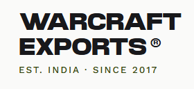

# ⚔️ Warcraft Exports

An enterprise-grade, high-performance e-commerce platform built for scale, speed, and seamless user experiences.

## 🚀 Overview

Warcraft Exports is a modern, full-stack web application designed to deliver a premium shopping experience. Built from the ground up utilizing the latest web technologies, it features dynamic interfaces, robust administrative controls, global payment gateways, and real-time database management.

## ✨ Key Features

*   **⚡ Blazing Fast UI:** Server-side rendered pages and static generation powered by Next.js 14 App Router.
*   **🎨 Premium Design System:** Beautiful, accessible, and responsive components built with Tailwind CSS, Shadcn UI, and smooth GSAP micro-animations.
*   **🔐 Secure Authentication:** Enterprise-level secure login, registration, and session management.
*   **💳 Global Payments:** Integrated checkout flows supporting multiple international gateways including Stripe, PayPal, and Razorpay.
*   **📦 Advanced Admin Dashboard:** Comprehensive tools for inventory management, rich-text product descriptions (Tiptap), order tracking, and dynamic shipping rates.
*   **🌍 Multi-Currency & Localization:** Real-time currency switching and language selection for a global audience.
*   **📊 Smart Analytics:** Integrated PostHog tracking to monitor user journeys and conversion metrics.
*   **☁️ Cloud Native:** Scalable cloud database architecture with secure image hosting via UploadThing.

## 🛠️ Technology Stack

*   **Framework:** [Next.js](https://nextjs.org/) (React)
*   **Styling:** [Tailwind CSS](https://tailwindcss.com/) & [Shadcn UI](https://ui.shadcn.com/)
*   **Database & Auth:** [Supabase](https://supabase.com/) (PostgreSQL)
*   **Payments:** Stripe, PayPal, Razorpay
*   **Animations:** GSAP & Tailwind Animate
*   **Analytics:** PostHog
*   **Email:** Resend
*   **Deployment:** Vercel

## 🛡️ Security & Best Practices

As a production application, security is heavily prioritized:
- All sensitive environment variables and API keys are strictly excluded from version control.
- Row Level Security (RLS) policies are enforced at the database level to ensure user data isolation.
- Administrative routes and API endpoints are protected by secure middleware checks.
- Server-side validation is strictly enforced utilizing Zod schemas.

---
*Developed with a focus on modern aesthetics, robust architecture, and exceptional user experience.*
